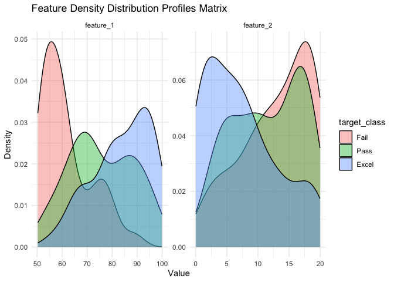
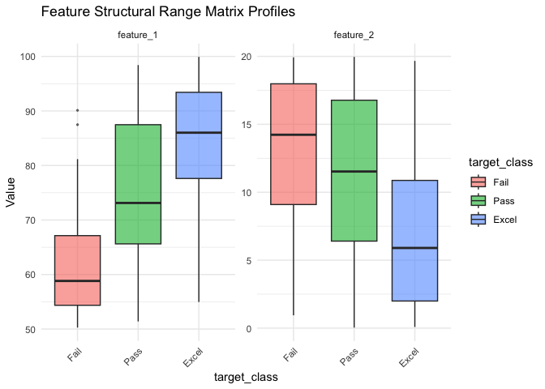
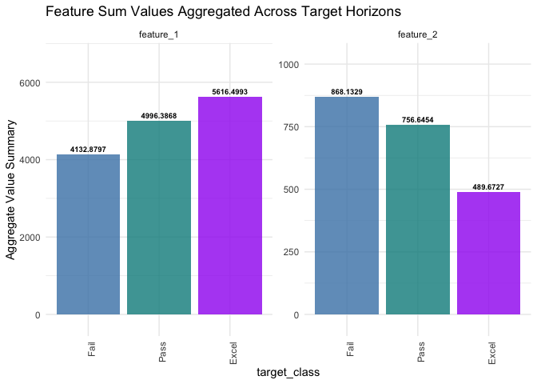
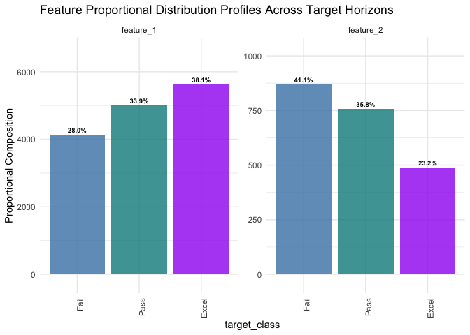
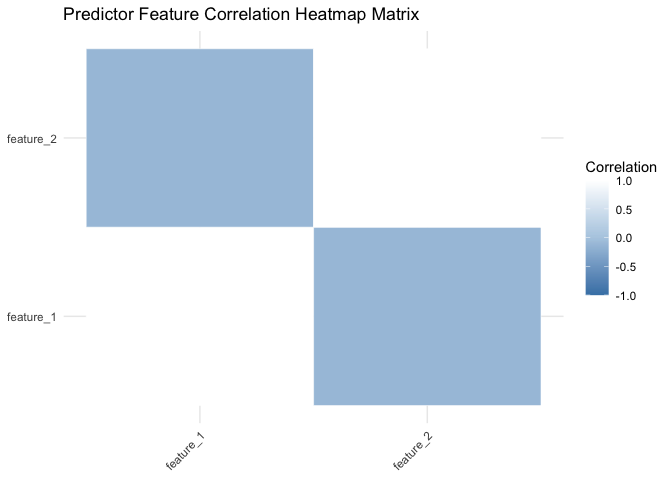
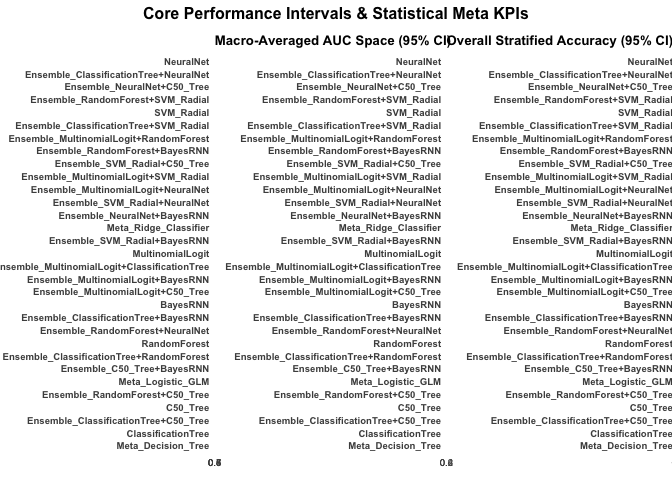
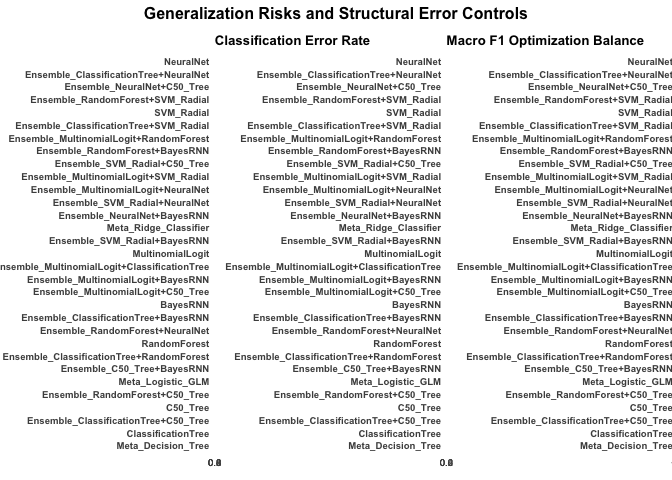
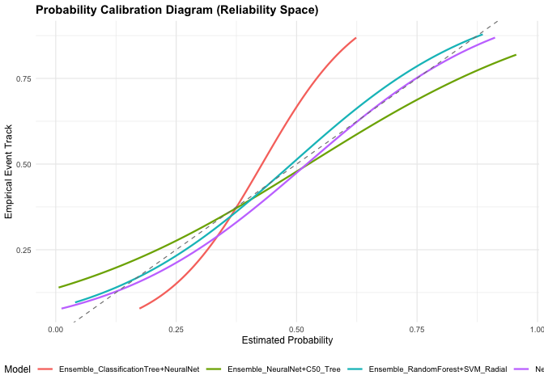
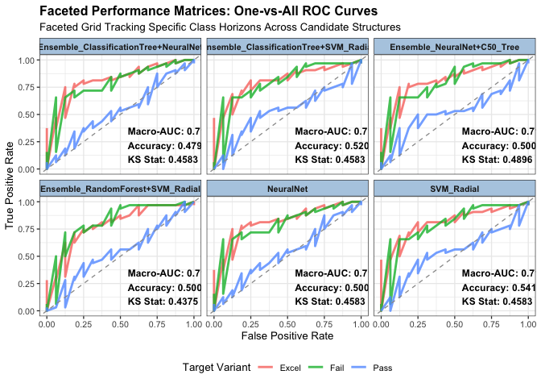

---

editor_options: 
  markdown: 
    wrap: 72
---

``` r
knitr::opts_chunk$set(
  collapse = TRUE,
  comment = "#>",
  fig.path = "man/figures/README-",
  out.width = "100%"
)
```

# ClassificationEnsembles

`ClassificationEnsembles` provides an automated machine learning stacking framework engineered to run multi-class predictive pipelines alongside advanced diagnostic suites.

Traditional classification tasks require manually searching through tuning spaces to select a single model. `ClassificationEnsembles` automates this process by deploying a **“Team of Rivals”** model evaluation engine. It fits multiple base learners concurrently—including Regularized Logits, Decision Trees, Random Forests, Support Vector Machines, and Neural Networks—and then fits optimized stacking meta-blenders to maximize classification precision.

## Installation

You can install the development version of `ClassificationEnsembles` from GitHub with:

``` r
# install.packages("devtools")
# devtools::install_github("InfiniteCuriosity/ClassificationEnsembles")
```

## Quick Start Example

This basic example trains a competitive multi-class stacking pipeline over the embedded student performance dataset:

``` r
library(ClassificationEnsembles)

# 1. Load the embedded multi-class education dataset
data(student_performance_strata)

# 2. Run the complete automated fast classification pipeline
class_fit <- Classification(
  dataset       = student_performance_strata,
  target_col    = "target_class",
  cv_folds      = 3,
  train_pct     = 0.75,
  vif_threshold = 5,
  config        = ClassificationFastConfig(),
  verbose       = FALSE
)

# 3. View the top-performing model architectures sorted by Macro-AUC
print(class_fit$performance_report[1:3, c("Model", "Macro_AUC", "Accuracy", "F1_Score")])
#>                                   Model Macro_AUC Accuracy F1_Score
#> 1                             NeuralNet    0.7181   0.5000   0.5038
#> 2 Ensemble_ClassificationTree+NeuralNet    0.7181   0.4792   0.4841
#> 3           Ensemble_NeuralNet+C50_Tree    0.7174   0.5000   0.5097
```

## Multi-Panel Model Diagnostic Dashboard

You can instantly visualize your classification intervals and generalization risk boundaries across the top 6 competing model families by invoking the native S3 `plot()` method directly on your pipeline asset:

``` r
# Plot the complete diagnostic curves canvas matrix
plot(class_fit, pace_output = FALSE)
```



```         
#> `geom_smooth()` using formula = 'y ~ x'
```



```         
#> Assembling High-Density Faceted Matrix One-vs-All ROC Curves Canvas...
```


