Welcome to ClassificationEnsembles! The goal of ClassificationEnsembles is to automatically conduct a thorough analysis of classification data. The user only needs to provide the data, answer a few questions, and the package does all the rest for you!.

ClassificationEnsembles automatically fits 15 individual models, to the training data, and also makes predictions and checks accuracy on the test and validation data sets.It also builds 10 ensembles of models, fits each ensembles model to the training ensemble data, makes predictions and checks accuracy on the test and validation data. The package automatically returns 11 plots, and four summary tables. The summary report shows the most accurate results at the top of the report.

The function will automatically work with any number of levels. In this example the data has three levels. Note that the function will automatically figure out the three levels, and build the models from there.

# Installation

You can install the development version of ClassificationEnsembles like so:

```         
devtools::install_github("InfiniteCuriosity/ClassificationEnsembles")
```

# Example

```         
Classification(data = ISLR::Carseats,
  colnum = 7,
  numresamples = 2,
  do_you_have_new_data = "N",
  how_to_handle_strings = 1,
  save_all_trained_models = "N",
  use_parallel = "N",
  train_amount = 0.60,
  test_amount = 0.20,
  validation_amount = 0.20)
```

ClassificationEnsembles will automatically build 25 models to predict the location of carseats (Bad, Medium, Good). The data is available as part of the ISLR package.

This is the head of the data set. We will be modeling the ShelveLoc column:

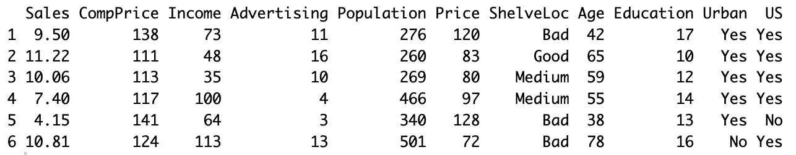{width="700"}

**The 15 individual classification models are:**

Adabag

Bagging

Bagged Random Forest

C50

Linear

Naive Bayes

Partial Least Squares

Penalized Discriminant Analysis

Random Forest

Ranger

Regularized Discriminant Analysis

RPart

Support Vector Machines

Trees

XGBoost

<br>

**The 10 ensembles are:**

Ensemble ADA Bag

Ensemble Bagged Cart

Ensemble Bagged Random Forest

Ensemble C50

Ensemble Naive Bayes

Ensemble Ranger

Ensemble Random Forest

Ensemble Regularized Discriminant Analysis

Ensemble Support Vector Machines

<br>

**The 11 plots automatically created (these are close-up views)**

Accuracy by model and resample

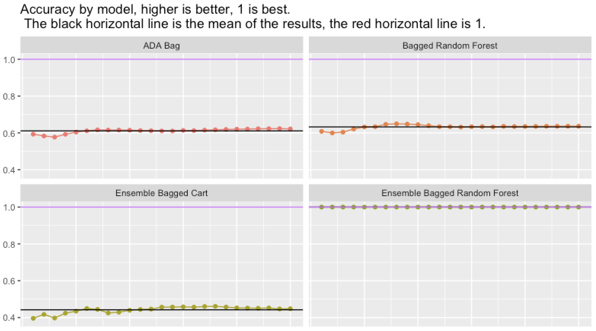{width="700"}

<br>

Accuracy including train and holdout

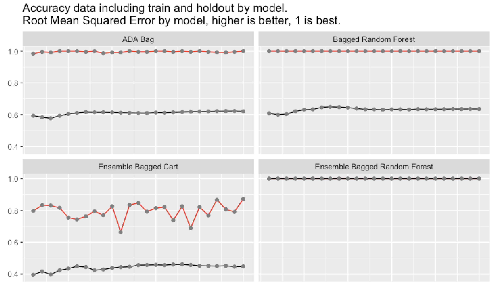{width="700"}

Note that Ensemble Bagged Random Forest had 100% accuracy on the holdout data, 25 times in a row.

<br>

Boxplots of the numeric data

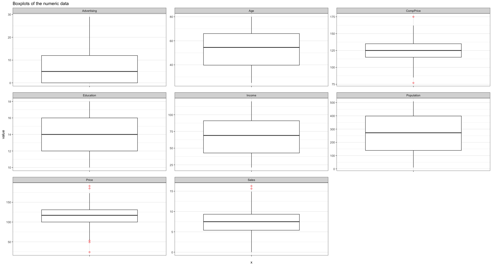{width="700"}

<br>

Correlation of the numeric data as numbers and colors

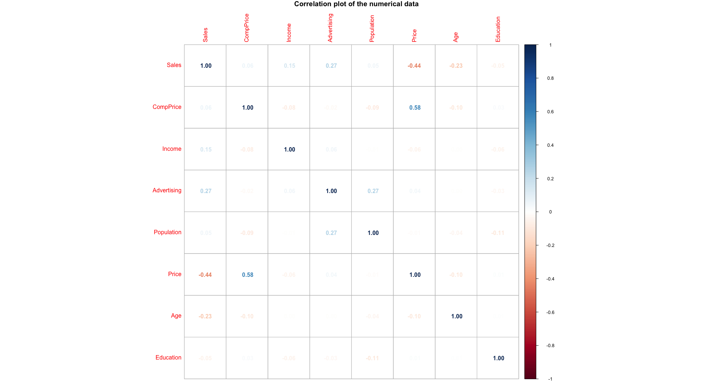{width="700"}

<br>

Duration barchart

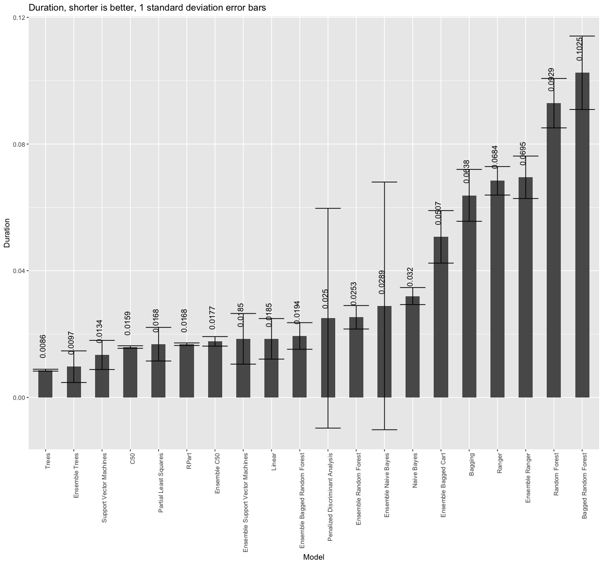{width="700"}

<br>

Histograms of the numeric columns

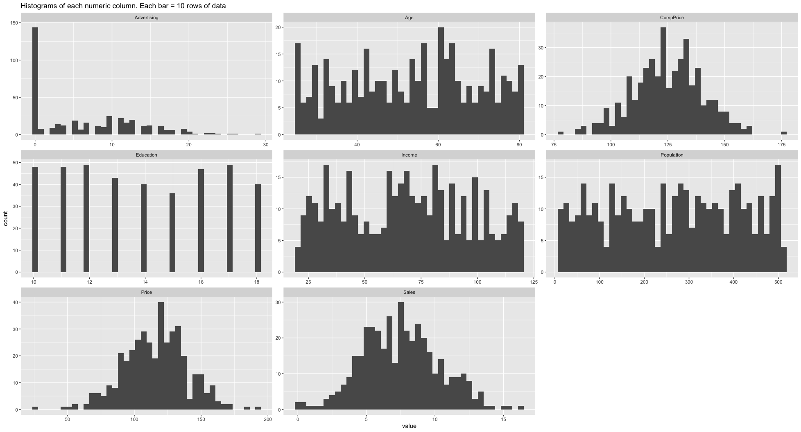{width="700"}

<br>

Model accuracy barchart

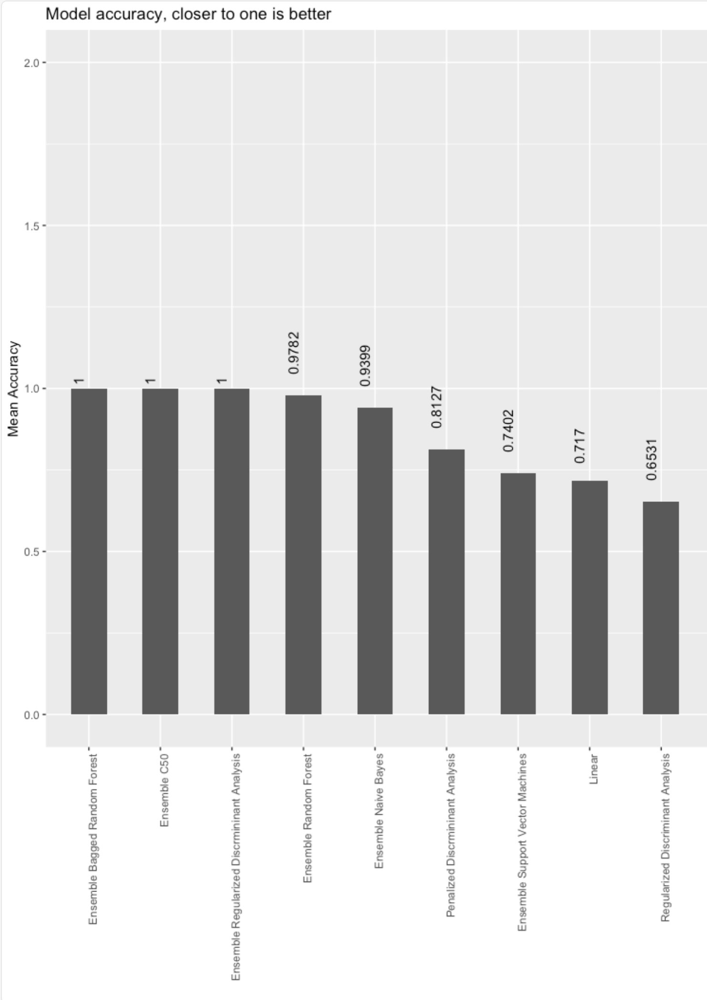{width="700"}

<br>

Over or underfitting barchart

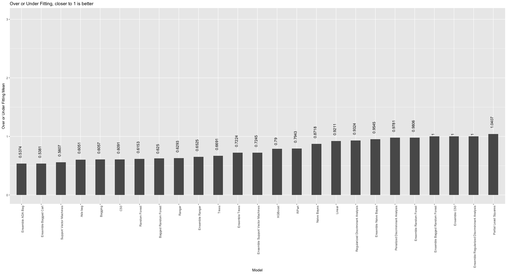{width="700"}

<br>

Pairwise scatterplots of the numeric data

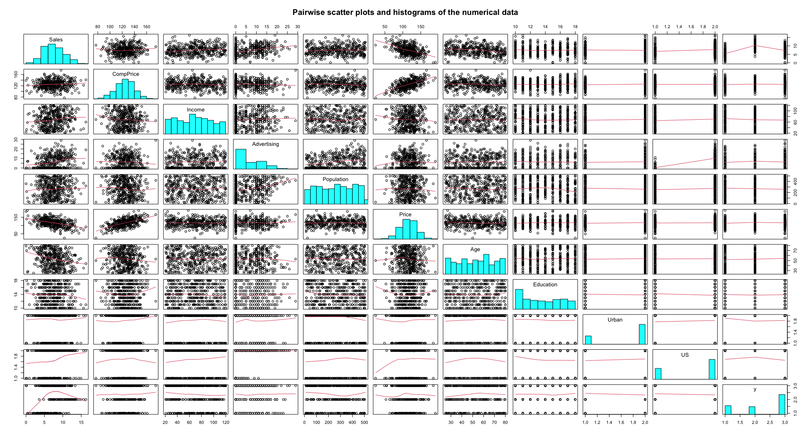{width="700"}

<br>

Target vs each feature

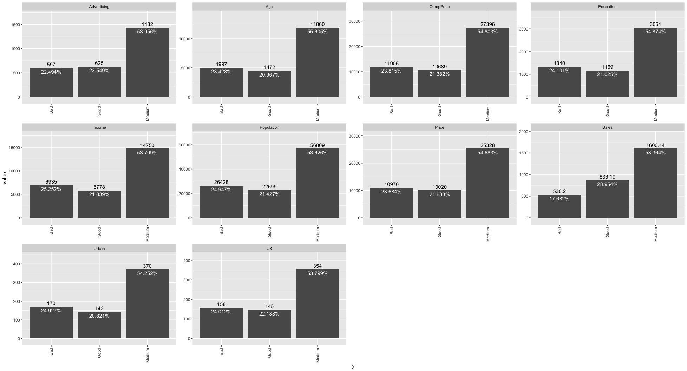{width="700"}

<br>

**Summary report example:**

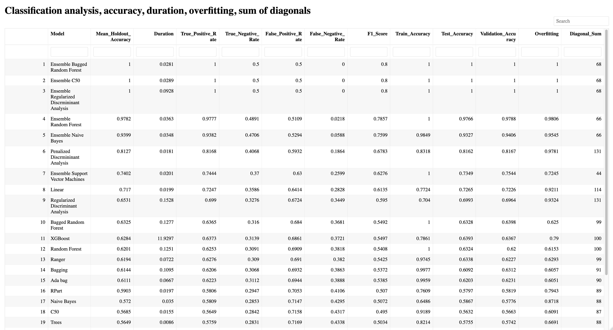{width="700"}

The summary report provides the following for each classification model:

Model name

Holdout accuracy (note the best three models in this example are all ensembles)

Duration

True Positive Rate

True Negative Rate

False Positive Rate

False Negative Rate

F1 Score

Train Accuracy

Test Accuracy

Validation Accuracy

Overfitting

Diagonal Sum

**Tables provided:**

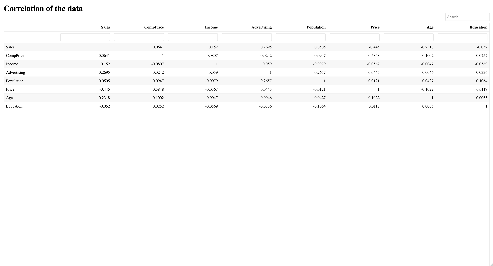{width="700"}

<br>

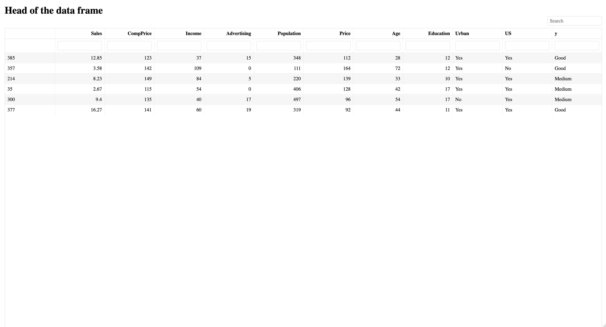{width="700"}

<br>

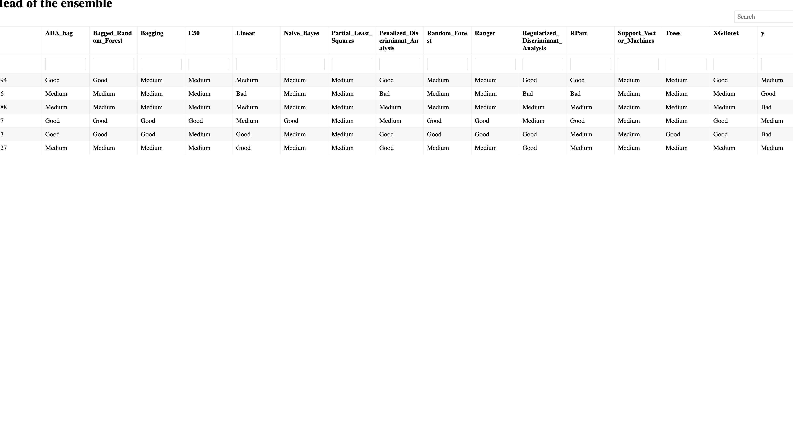{width="700"}

**Summary tables for all models (top three shown in the graphic)**

The package also provides summary tables for all models. Here are the summary tables for the models with the highest accuracy:

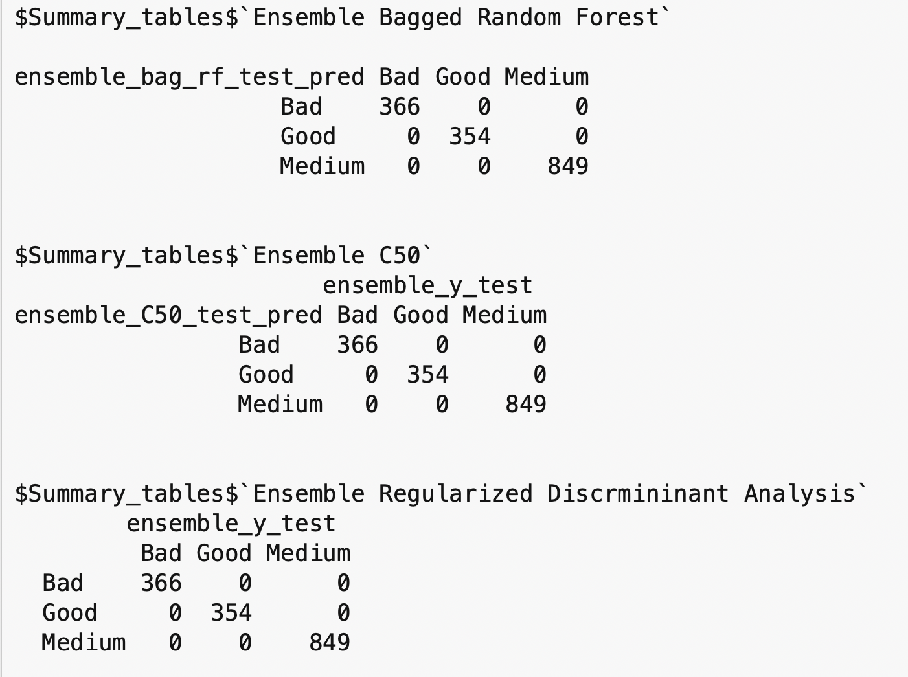{width="700"}

# Grand summary

The ClassificationEnsembles package was able to build 25 classification models from the Carseats data. Three of the ensembles had 100% accuracy 25 times in a row on the holdout data.

The package also automatically provided 11 plots, three tables, a summary report, and summary tables all the models.
